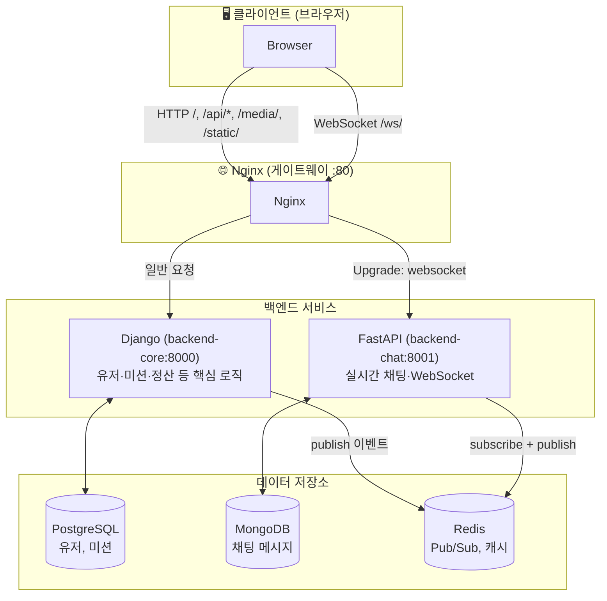
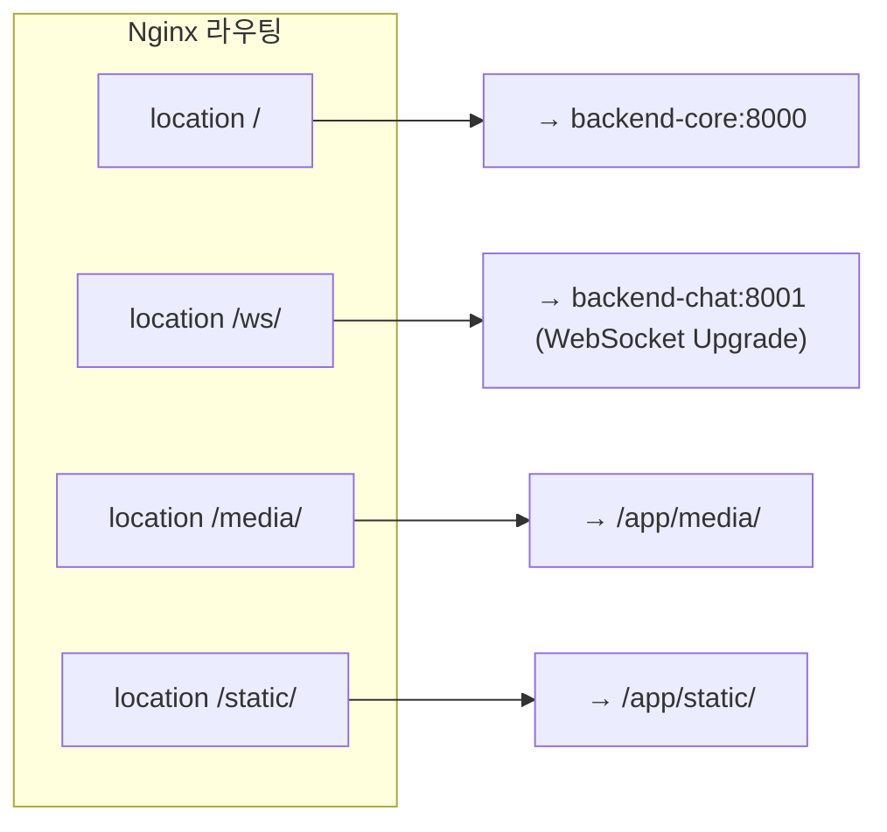
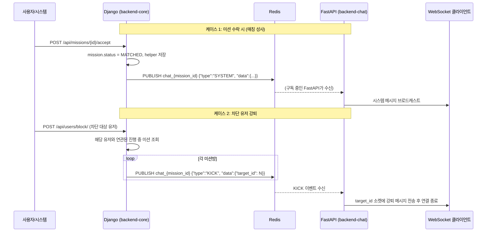
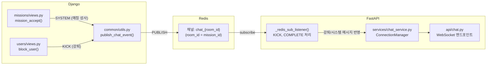
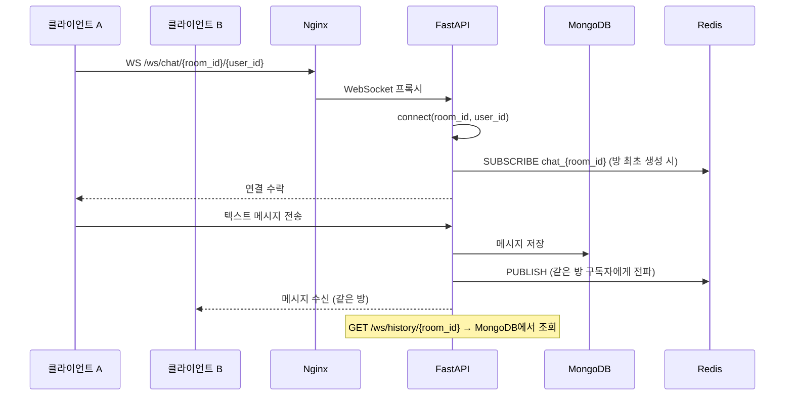

# Uniquest: Django ↔ FastAPI 통신 구조

## 1. 전체 아키텍처 (클라이언트 관점)

---

## 2. Nginx 라우팅 규칙

---

## 3. Django → FastAPI 간 통신 (Redis Pub/Sub)

**Django와 FastAPI는 HTTP로 직접 호출하지 않습니다.**  
이벤트 기반 통신을 위해 **Redis Pub/Sub**을 사용합니다.

---

## 4. Redis 채널 규칙 및 역할 분리

| 발신 (Django) | 이벤트 타입 | 의미 |
|---------------|-------------|------|
| 미션 수락 완료 | `SYSTEM` | 매칭 성사 알림 |
| 유저 차단 | `KICK` | 해당 유저를 연관 채팅방에서 강퇴 |

| 수신 (FastAPI) | 처리 |
|----------------|------|
| `KICK` | `data.target_id` 소켓에 강퇴 메시지 전송 후 연결 종료 |
| `COMPLETE` | 방 전체에 "미션이 완료되었습니다" 시스템 메시지 브로드캐스트 |

---

## 5. FastAPI 채팅 흐름 (클라이언트 ↔ FastAPI)

---

## 6. 요약: “Django와 FastAPI 간 통신” 정리

| 구분 | 내용 |
|------|------|
| **직접 HTTP 호출** | 없음. 서로의 API를 HTTP로 호출하지 않음. |
| **통신 수단** | **Redis Pub/Sub** (채널명: `chat_{room_id}`) |
| **Django 역할** | 비즈니스 로직 처리 후, 이벤트를 `publish_chat_event()`로 Redis에 발행. |
| **FastAPI 역할** | Redis를 구독해 `KICK`, `COMPLETE` 등 수신 후 WebSocket 클라이언트에 반영. |
| **왜 이렇게 설계했는지** | 서비스 간 **결합도 감소**(이벤트 기반), **확장성**(채팅 서버 다중 인스턴스 시에도 Redis 하나로 동기화 가능), **역할 분리**(Django=도메인/DB, FastAPI=실시간 소켓). |

이 문서는 `Uniquest/` 프로젝트 루트 기준 상대 경로로, `docs/architecture-django-fastapi-communication.md` 에 두고 사용하면 됩니다.
