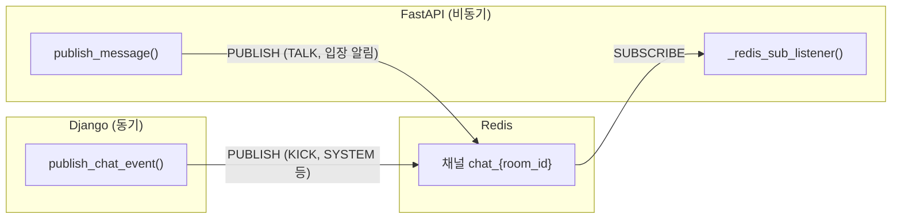

# Uniquest 프로젝트에서 Redis 사용 방식 정리

이 문서는 **Redis가 어디서, 왜, 어떻게 쓰이는지**와 **관련 코드를 한 줄씩 설명**하는 내용입니다.

---

## 1. Redis가 쓰이는 목적 (한 줄 요약)

- **Django와 FastAPI는 서로 HTTP로 호출하지 않고**, **Redis Pub/Sub** 하나를 공유해서 **이벤트**만 주고받습니다.
- 채널 이름 규칙: **`chat_{room_id}`** (room_id = 미션 ID)

---

## 2. 전체 흐름 (그림)



- **Django**: 비즈니스 로직 후 `publish_chat_event()`로 Redis에 **PUBLISH**
- **FastAPI**: `chat_{room_id}` 채널을 **SUBSCRIBE**하고, 수신한 이벤트에 따라 WebSocket 강퇴/시스템 메시지 처리
- **FastAPI**: 사용자 채팅/입장 알림은 `publish_message()`로 같은 채널에 **PUBLISH** (다중 인스턴스 시 동기화용)

---

## 3. Django 쪽 Redis 코드

### 3-1. 설정: `backend-core/config/settings.py`

```python
REDIS_URL = os.getenv('REDIS_URL', 'redis://localhost:6379')
```

- Docker Compose에서는 `REDIS_HOST=redis` 로 주입되므로, 실제로는 `redis://redis:6379` 형태로 쓰일 수 있음.
- 이 프로젝트에서는 **직접 이 변수를 쓰지 않고**, 아래 `common/utils.py`에서 **host='redis'** 로 연결 풀을 만듦.

---

### 3-2. 연결 풀 + 발행 함수: `backend-core/common/utils.py`

```python
import redis
import json
import logging
from django.conf import settings

logger = logging.getLogger(__name__)

# Redis 연결 풀 생성 (실무 효율성 포인트)
REDIS_POOL = redis.ConnectionPool(host='redis', port=6379, db=0)

def publish_chat_event(room_id: str, event_type: str, data: dict):
    """
    room_id: 미션 ID (예: "15")
    event_type: "KICK", "COMPLETE", "MATCHED" 등
    data: 추가 정보 (예: {"target_id": 10})
    """
    try:
        r = redis.StrictRedis(connection_pool=REDIS_POOL)
        message = {
            "type": event_type,
            "data": data,
            "sender": "system"
        }
        # Redis 채널명 규칙: chat_{room_id}
        channel = f"chat_{room_id}"
        r.publish(channel, json.dumps(message, ensure_ascii=False))
        logger.info(f"Redis Publish 성공: {channel} -> {event_type}")
    except redis.RedisError as e:
        logger.error(f"Redis Publish 실패: {e}")
```

**코드 설명:**

| 부분 | 설명 |
|------|------|
| `REDIS_POOL` | 매 요청마다 새 TCP 연결을 열지 않고 **연결 풀**을 재사용. 동시 요청이 많아도 연결 수를 제한할 수 있어 실무에서 선호하는 방식. |
| `publish_chat_event(room_id, event_type, data)` | **동기 함수**. Redis에 메시지를 한 번 **PUBLISH**하고 끝. |
| `r = redis.StrictRedis(connection_pool=REDIS_POOL)` | 풀에서 연결 하나를 가져와서 사용. |
| `message` | FastAPI 쪽에서 기대하는 형식: **`type`**(이벤트 종류), **`data`**(payload), **`sender`**(system). |
| `channel = f"chat_{room_id}"` | Django와 FastAPI가 **같은 채널 이름 규칙**을 써야 구독/발행이 맞닿음. |
| `r.publish(channel, json.dumps(...))` | Redis **PUBLISH**는 “fire-and-forget”: 보내기만 하고, 누가 받는지는 Django가 신경 쓰지 않음. |

**Django가 보내는 메시지 예:**

- 매칭 성사:  
  `{"type": "SYSTEM", "data": {"content": "매칭이 성사되었습니다! ..."}, "sender": "system"}`
- 강퇴:  
  `{"type": "KICK", "data": {"target_id": 10}, "sender": "system"}`

---

### 3-3. 호출처 1: 미션 수락 (매칭 성사) — `backend-core/missions/views.py`

```python
from common.utils import publish_chat_event

# ... mission_accept 뷰 내부 ...

    # 매칭 성공 로직
    mission.status = "MATCHED"
    mission.helper = request.user
    mission.save()

    # 🚀 핵심: 매칭 즉시 채팅방에 시스템 메시지 전송
    publish_chat_event(
        room_id=str(mission.id),
        event_type="SYSTEM",
        data={"content": "매칭이 성사되었습니다! 대화를 시작해보세요."}
    )

    return JsonResponse({...})
```

- **언제:** 헬퍼가 미션을 수락해서 `status`가 `MATCHED`로 바뀐 직후.
- **역할:** 해당 미션(채팅방)에 “매칭 성사” 시스템 메시지를 **Redis 한 번 PUBLISH**해서, 그 방을 구독 중인 FastAPI가 받아서 WebSocket 클라이언트들에게 전달할 수 있게 함.

---

### 3-4. 호출처 2: 유저 차단 (채팅방 강퇴) — `backend-core/users/views.py`

```python
from common.utils import publish_chat_event

# ... get_blocked_users_info (차단 API) 내부 ...

        user.blocked_people.add(target_user)

        # 두 유저가 연관된 '진행 중인' 미션방들을 모두 찾음
        related_missions = Mission.objects.filter(
            models.Q(author=user, helper=target_user) |
            models.Q(author=target_user, helper=user)
        ).filter(status__in=['WAITING', 'MATCHED'])

        # 찾은 모든 방에 대해 각각 강퇴 이벤트 발행
        for mission in related_missions:
            publish_chat_event(
                room_id=str(mission.id),
                event_type="KICK",
                data={"target_id": target_user_id}
            )

        return Response({"message": "차단 및 실시간 강퇴 완료"}, ...)
```

- **언제:** A가 B를 차단했을 때.
- **역할:** A–B가 함께 있는 모든 진행 중 미션(채팅방)에 대해, **방마다** `KICK` 이벤트를 Redis로 PUBLISH. FastAPI는 `data.target_id`를 보고 해당 유저의 WebSocket만 강퇴 처리.

정리하면, **Django는 Redis를 “이벤트 발행” 용도로만 사용**하고, 구독이나 응답은 하지 않습니다.

---

## 4. FastAPI 쪽 Redis 코드

### 4-1. Redis 클라이언트 설정: `backend-chat/app/core/config.py`

```python
import os
import redis.asyncio as aioredis

REDIS_URL = os.getenv("REDIS_URL", "redis://redis:6379")

# Redis 클라이언트 설정
redis_client = aioredis.from_url(REDIS_URL, decode_responses=True)
```

- **`redis.asyncio`** : FastAPI(비동기)에서 블로킹하지 않도록 **비동기 Redis 클라이언트** 사용.
- **`decode_responses=True`** : Redis에서 오는 바이트를 자동으로 **문자열**로 받음. `json.loads(message['data'])` 할 때 편함.

---

### 4-2. 구독 + 발행: `backend-chat/app/services/chat_service.py`

#### (1) 인스턴스 변수

```python
class ConnectionManager:
    def __init__(self):
        self.active_connections = {}   # room_id -> { user_id: WebSocket }
        self.pubsub_tasks = {}         # room_id -> asyncio.Task (구독 태스크)
```

- **`active_connections`** : 방별로 어떤 user_id가 어떤 WebSocket을 쓰는지 저장.
- **`pubsub_tasks`** : 방마다 **Redis 구독 루프**를 하나의 asyncio Task로 돌리고, 나중에 방이 비면 `cancel()` 하기 위해 보관.

---

#### (2) 방 생성 시 구독 시작: `connect()`

```python
    async def connect(self, websocket: WebSocket, room_id: str, user_id: int):
        await websocket.accept()

        if room_id not in self.active_connections:
            self.active_connections[room_id] = {}
            # Redis 구독 시작 (방이 처음 생길 때만)
            self.pubsub_tasks[room_id] = asyncio.create_task(self._redis_sub_listener(room_id))

        self.active_connections[room_id][user_id] = websocket
```

- **방이 처음 생길 때만** `_redis_sub_listener(room_id)` 를 **백그라운드 Task**로 실행.
- 그 방의 **모든 메시지**(Django의 KICK/SYSTEM, FastAPI의 TALK 등)가 채널 `chat_{room_id}` 로 오므로, 한 번만 구독하면 됨.

---

#### (3) Redis 구독 루프: `_redis_sub_listener(room_id)`

```python
    async def _redis_sub_listener(self, room_id):
        pubsub = redis_client.pubsub()
        await pubsub.subscribe(f"chat_{room_id}")

        try:
            async for message in pubsub.listen():
                if message['type'] == 'message':
                    payload = json.loads(message['data'])
                    msg_type = payload.get("type")
                    data = payload.get("data", {})

                    if msg_type == "KICK":
                        target_id = int(data.get("target_id"))
                        await self._kick_user(room_id, target_id)

                    elif msg_type == "COMPLETE":
                        await self._local_broadcast({
                            "type": "SYSTEM",
                            "content": "미션이 완료되었습니다."
                        }, room_id)
        except Exception as e:
            print(f"FastAPI Redis 리스너 에러: {e}")
```

**코드 설명:**

| 부분 | 설명 |
|------|------|
| `pubsub = redis_client.pubsub()` | Pub/Sub 전용 연결. |
| `await pubsub.subscribe(f"chat_{room_id}")` | Django와 **동일한 채널명** 구독. |
| `async for message in pubsub.listen()` | 이 채널로 들어오는 메시지를 **무한 루프**로 수신. |
| `message['type'] == 'message'` | Redis Pub/Sub에서 실제 데이터가 오는 타입만 처리 (subscribe 확인 메시지 등은 스킵). |
| `payload.get("data", {})` | **Django가 보낸 형식**이 `{ type, data, sender }` 이므로, `data` 안에 `target_id` 등이 들어 있음. |
| **KICK** | Django가 차단 시 보낸 이벤트. `target_id` 유저의 WebSocket에 강퇴 메시지 보내고 연결 종료. |
| **COMPLETE** | (추후 미션 완료 처리 시) 해당 방 전체에 “미션이 완료되었습니다” 시스템 메시지 브로드캐스트. |

즉, **FastAPI는 Redis로 “Django가 보낸 이벤트”만 구독해서 처리**하고, TALK/입장 알림은 아래 `publish_message()`로 보내기만 합니다.

---

#### (4) 강퇴: `_kick_user(room_id, target_id)`

```python
    async def _kick_user(self, room_id, target_id):
        if room_id in self.active_connections:
            target_socket = self.active_connections[room_id].get(target_id)
            if target_socket:
                try:
                    await target_socket.send_text(json.dumps({
                        "type": "KICK",
                        "content": "방장에 의해 강퇴되었습니다."
                    }, ensure_ascii=False))
                    await target_socket.close(code=4000)
                except:
                    pass
```

- **역할:** Redis에서 KICK 이벤트를 받았을 때, 해당 방의 `target_id` WebSocket만 골라서 메시지 보내고 **연결 종료**.

---

#### (5) 같은 프로세스 내 브로드캐스트: `_local_broadcast()`

```python
    async def _local_broadcast(self, message, room_id):
        if room_id in self.active_connections:
            for connection in self.active_connections[room_id].values():
                try:
                    await connection.send_text(json.dumps(message, ensure_ascii=False))
                except:
                    pass
```

- **역할:** COMPLETE 등으로 “방 전체에 시스템 메시지”를 보낼 때, **현재 FastAPI 프로세스에 붙어 있는** 해당 방의 모든 WebSocket에만 전송. Redis를 거치지 않음.

---

#### (6) Redis로 메시지 발행: `publish_message()`

```python
    async def publish_message(self, message, room_id):
        # Django와 채널명을 맞춰야 합니다 (chat_{room_id})
        await redis_client.publish(f"chat_{room_id}", json.dumps(message, ensure_ascii=False))
```

- **역할:**  
  - 입장 알림, 일반 채팅(TALK) 등을 **같은 채널 `chat_{room_id}`** 로 PUBLISH.  
  - FastAPI를 여러 워커로 띄우면, 다른 프로세스가 구독 중인 같은 채널로도 전달되므로 **다중 인스턴스 간 동기화**에 쓸 수 있음.  
- **참고:** 현재 `_redis_sub_listener`는 **KICK / COMPLETE**만 처리하고, TALK/입장 알림은 처리하지 않음. 즉, 지금 구조에서는 “채팅 메시지 브로드캐스트”는 같은 프로세스 내에서만 되고, Redis PUBLISH는 “나중에 다중 인스턴스에서 TALK도 구독해서 브로드캐스트”하도록 확장할 때 쓰이는 설계로 보면 됨.

---

### 4-3. API에서의 사용: `backend-chat/app/api/chat.py`

```python
    await chat_manager.connect(websocket, room_id, user_id)

    # 입장 알림
    await chat_manager.publish_message({
        "type": "SYSTEM",
        "sender_id": 0,
        "content": f"유저 {user_id} 입장",
        "time": datetime.now().strftime("%H:%M")
    }, room_id)

    try:
        while True:
            data = await websocket.receive_text()
            msg_obj = ChatMessage(...)
            await chat_manager.save_message(msg_obj)
            await chat_manager.publish_message({
                "type": "TALK",
                "sender_id": user_id,
                "content": data,
                "time": msg_obj.created_at.strftime("%H:%M")
            }, room_id)
    except WebSocketDisconnect:
        await chat_manager.disconnect(room_id, user_id)
```

- **입장 시:** `publish_message`로 `SYSTEM` 타입 한 번 Redis에 발행.
- **채팅 시:** MongoDB 저장(`save_message`) + `publish_message`로 `TALK` 타입 Redis에 발행.
- **연결 종료 시:** `disconnect(room_id, user_id)` 로 소켓 제거·방 비면 구독 Task 취소.

---

## 5. 메시지 형식 정리

| 발신 측 | 용도 | Redis 메시지 형식 |
|--------|------|-------------------|
| Django | KICK / SYSTEM / COMPLETE | `{"type": "KICK"\|"SYSTEM"\|"COMPLETE", "data": {...}, "sender": "system"}` |
| FastAPI | 입장 알림, TALK | `{"type": "SYSTEM"\|"TALK", "sender_id", "content", "time"}` (`data` 래퍼 없음) |

- FastAPI의 `_redis_sub_listener`는 **`payload.data`** 를 쓰므로, **Django 형식**(`type` + `data`)만 처리하고 있음.
- KICK일 때 `data.target_id`, COMPLETE일 때 방 전체 브로드캐스트만 하면 되므로, 현재 구조로 Django → FastAPI 이벤트 전달은 정상 동작합니다.

---

## 6. 요약 표

| 구분 | Django | FastAPI |
|------|--------|--------|
| **Redis 역할** | PUBLISH만 (이벤트 발행) | SUBSCRIBE + PUBLISH |
| **연결 방식** | 동기 `redis.StrictRedis` + ConnectionPool | 비동기 `redis.asyncio` + `from_url` |
| **채널** | `chat_{room_id}` (room_id = mission_id) | 동일 |
| **발행 내용** | KICK, SYSTEM(매칭), COMPLETE 등 | TALK, 입장 SYSTEM (현재 리스너는 미처리) |
| **구독 처리** | 없음 | `_redis_sub_listener`에서 KICK, COMPLETE만 처리 |

이렇게 정리하면, Redis는 “Django와 FastAPI 간 이벤트 버스”로만 쓰이고, 모든 실제 로직은 각 서버가 자기 쪽 코드로 처리하는 구조입니다.
